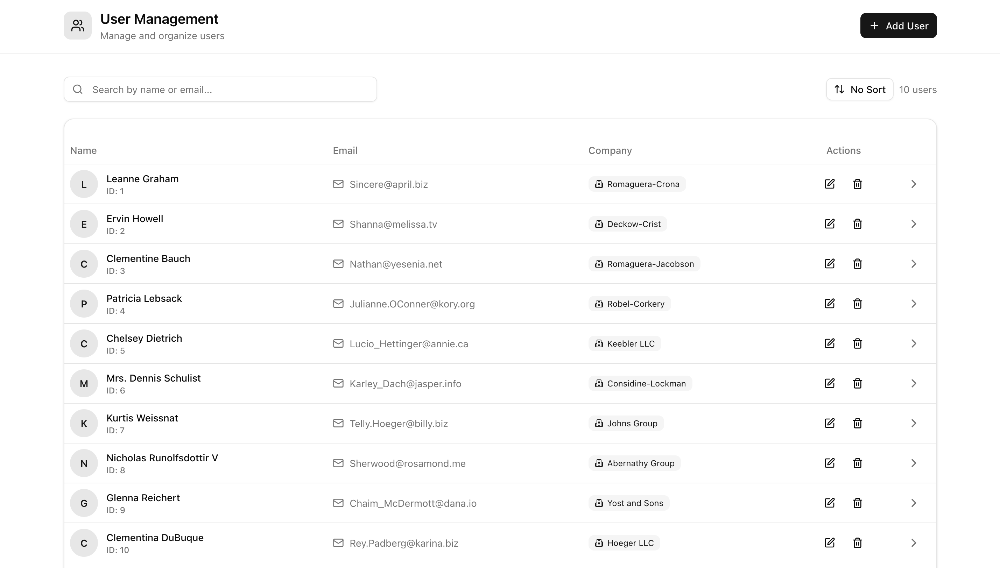

# User Management System

A React application for managing users with local CRUD operations. Features responsive design, Redux state management, and integrates with JSONPlaceholder API for user data handling.

## How It's Made:

**Tech used:** React, TypeScript, Redux Toolkit, Tailwind CSS, Vite, React Router, Shadcn

This project showcases React development practices. Built with TypeScript for type safety and Redux Toolkit for state management. The application fetches users from JSONPlaceholder API and allows local CRUD operations with instant feedback through toast notifications.

The responsive design uses Tailwind CSS where information adapts based on screen size. Form validation ensures data integrity, while components were structured in order to be reusable.

## Getting Started

Steps to Run the Project:

1. Install Dependencies:
`npm install`

2. Start the Development Server
`npm run dev`

